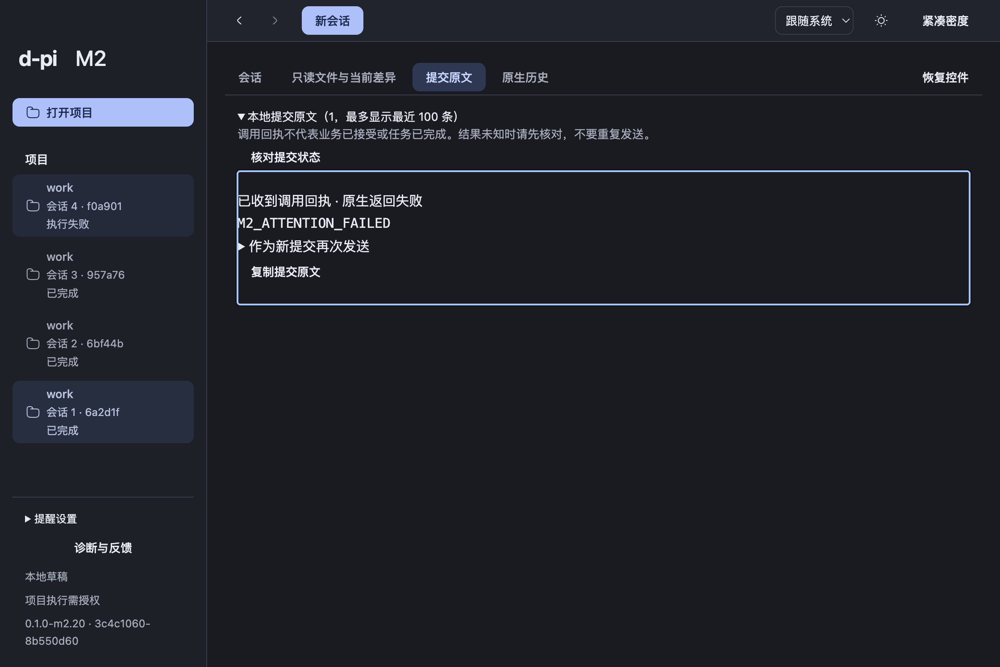

# 多 Thread 提醒当前交接

2026-10-06，当前交付 clean `0.1.0-m2.20 / 3c4c1060-8b550d60`，产品source `3c4c1060cd7943cb435ac73da3d8bd03433d4954`，本地/远端分支 `codex/m2-thread-attention`。[Draft PR #4](https://github.com/LouisGo/d-pi/pull/4)覆盖基础诊断和提醒两个切片。01a/01b工程完成，01c系统显示/点击仍待验；M2实施中、已交付待试用、用户认可pending。已授权push/PR，未merge、不扩M3。

## 已实现与本次PR修复

Main复用实际Runtime/收据生成有界待答/失败/完成未读投影，观察独立于窗口/React；最多512项，超预算显示覆盖缺口。App内提醒不自动导航或抢焦点；点击使用既有保存/导航准入，定位实际交互或同trace失败收据，可恢复控件并保留Editor/草稿。完成默认仅侧栏状态，系统/完成提醒均明确opt-in；偏好属App SQLite，不写OMP共享配置。通知仅通用自有文案与短Thread ID，失败保留App状态和既有诊断trace；反馈不上传。

提醒中心按共享控件token独立滚动，当前阅读至少四行，Composer保持可见。迟到首次Runtime inspect等待DOM就位，后续采样不夺焦。失败收据定位保留可读空间，过期点击不作答或重发。

PR组合审查又确认一项P2：Main已select(B)但异步恢复尚未回复时，旧A可见标记使A新问题错误已读。真实SQLite/DesktopCommandService/ThreadAttention与正式React回归先红后绿。现Main在可见相关事件读取真实active owner，add/seen/foreground清未读都需身份一致，读取失败保守保留；Renderer在pending撤销可见声明。36相关通过、两轴独立复核关闭原问题且无新增高价值发现：[评审](attention-review.md)。不新增调度/队列事实、不改变cold只读或unknown不重发。

## 验证与证据边界

修复后完整`pnpm check`通过：798行为、34架构、74工具，2既有opt-in跳过；类型/设计/i18n/文档/模块/结构/看板通过。[原始检查](evidence/pr-switch-engineering-check.txt)。首次import排序及随后生成结构陈旧失败保留，按当前源纠正后全门禁通过，不掩盖失败。

从干净3c4c106构建m2.20，执行实际Electron包`--attention`，17项受影响路径通过：[完整结果](evidence/attention-macos-m2.20/m2-result.json)、[提醒结果](evidence/attention-macos-m2.20/attention-result.json)、[日志](evidence/attention-macos-m2.20/package-log.txt)。隔离HOME/App数据/OMP配置/Git/项目，固定SDK+localhost供应商，不继承个人凭据或使用付费供应商。实际待答与HTTP400失败、正确Thread/交互/失败收据定位、双scope/草稿选择撤销、reload无重发、冷启动偏好与旧Thread只读通过。四组4条明确新unread提醒覆盖正常/紧凑/English560px/恢复布局：中心64/60px、scroll128/120px，reading78px/19.5px行高，阅读与完整Composer有效可见、最后项focus/内部滚动可达、原焦点恢复及草稿完整；截图实看。

**m2.20没有重跑原生inspect，也没有真实系统显示/点击证据。** 原m2.19实际CUA后台/Cmd+W关窗/Finder同Main重开无重发，以及system=failed/App可见反馈的18项记录保留在[历史快照](attention-m2.19.md)与[evidence](evidence/attention-macos-m2.19/m2-result.json)，不冒称属于3c4c106。系统失败根因unknown，未模拟callback，未签名/公证。01c继续claimed；已有成功关窗路径与系统送达未知分别说明。

Chromium composition不等同系统IME，隔离SDK不等同真实账户/用户认可。PDF视觉/OCR、完整V1-00/B6负载故障全集、真实供应商和M2最终组合仍开放：[整体进度](progress-2026-10-06.md)。

## 最终候选与试用

| 项目 | 精确身份 |
| --- | --- |
| 产品source | `3c4c1060cd7943cb435ac73da3d8bd03433d4954` |
| Build | `0.1.0-m2.20 / 3c4c1060-8b550d60`，dirty=false |
| App | `/Users/louistation/.codex/worktrees/a613/d-pi/dist/attention-m2.20-pr-clean/mac-arm64/d-pi.app` |
| ZIP | `/Users/louistation/.codex/worktrees/a613/d-pi/dist/candidates/d-pi-0.1.0-m2.20-macos-arm64-3c4c1060.zip` |
| ZIP字节/SHA256 | 430118461 / `1011a3517f295b35d97c5f012222db2423880ab04222397499399ff61f5deabb` |
| app.asar SHA256 | `8c51f1427708aa82d2cde00b9563a6780de5a13fd44f7d8143c354da74907231` |
| 环境 | macOS arm64；Node24.21.0/pnpm12.8.1/Electron44.4.5/Bun1.3.14/OMP18.4.6 |

全部ZIP entry CRC通过，source App、受测含空格路径副本、ZIP app.asar完全一致：[机器身份](evidence/attention-package-identity-m2.20.json)、[build](evidence/attention-m2.20-build.txt)、[pack](evidence/attention-m2.20-pack.txt)。后续仅交接/评审/结构报告更新，产品身份仍为3c4c106，不能用PR文档提交冒称新构建。旧候选及失败证据保留。[交接检查](evidence/pr-delivery-fast.txt)。

1. 启动上述App，核对build3c4c1060-8b550d60。
2. 已有可用配置下新建独立A/B，后台待答/失败，切回A；草稿焦点保留。切换期间旧Thread新事件应仍有未读提醒；点击定位当前交互/可读失败收据，恢复控件，查看不回答或重发。
3. 多提醒内部滚动，最后项可达，当前阅读/草稿保持；正常/紧凑/窄窗均可试用。完成默认静默，明确开启偏好后系统能力不等于送达，App失败反馈保留。
4. 用户真实供应商/日常体验复试独立，未推断认可。若要退回schema11以前，源码revert不能降级数据库，按PR回滚说明保留数据并使用升级前备份，不删库。

