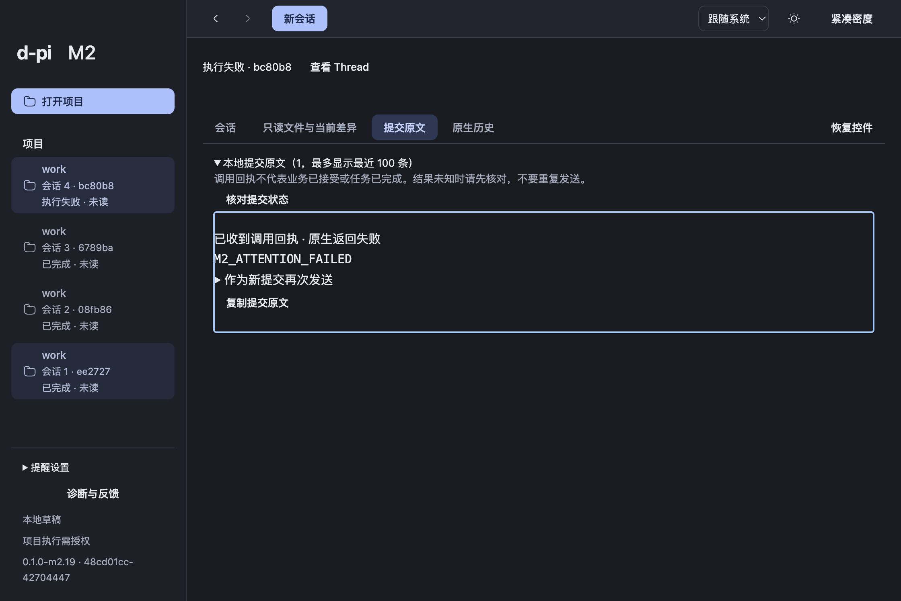

# 多 Thread 提醒交接

2026-10-06，当前本地分支 `codex/m2-thread-attention`。已交付 clean m2.19 候选：Main 提醒投影、正式 GUI、阅读空间预算及迟到原生状态定位完成，两轴独立评审问题已修复。01a/01b 工程完成；01c 保持 claimed，实际系统通知显示/点击未验收。M2 工程 in-progress、trial delivered、用户认可 pending。本轮不 push、不扩 M3。

## 已实现行为

后台 Thread 待回答或失败，显示可点击应用内提醒和侧栏状态，不自动导航或抢焦点。完成默认只更新完成/未读；系统与完成提醒均需明确开启。点击待答进入当前真实交互，首次 Runtime 状态迟到时等待实际 DOM 就位，只在明确点击意图时定位，后续状态不夺回 Composer 焦点。失败点击定位同 trace 收据并展开，仅实际匹配收据时进入既有专注阅读，可恢复控件，Editor/草稿保留。过期点击查看当前状态，不作答或重发。

多条提醒按共享 control-height 限制高度并独立滚动，为当前阅读保留至少四行；设置区域沿用既有独立滚动，Composer 保持可见。未截断或丢弃提醒。Main 复用真实 RuntimeView/SubmissionReceipt；ACK、busy=false 不作为完成。新问题使用新提醒身份，迟到终态失败可纠正完成；Renderer reload 或暂时无窗口保持独立观察。最多512项，溢出表达覆盖缺口。偏好独立存于 App SQLite；系统通知仅通用自有文案和六位 Thread ID，不读业务全文、秘密或 OMP 原生日志。

通知失败保留 App 内事实及可见反馈，复用既有诊断 trace，精确自有码 notification-unavailable 可脱敏导出。available 只表示能力，不能证明 OS 许可或送达。

## 验证与限制

完整 `pnpm check`：796行为、34架构、74工具通过，2既有 opt-in 跳过：[原始结果](evidence/attention-reminder-engineering-check.txt)。真实 React/RuntimeModel 迟到 inspect 先红后修复，相关19项通过；原预算红灯与验证脚本失败分开保存：[TDD记录](evidence/attention-reminder-continuation-tdd.md)、[双轴评审](attention-review.md)。没有以静态评审替代实际包验收。

最终 `node validation/m2/package.mjs <clean-app> --attention --attention-inspect` 使用固定 SDK extension 与 localhost 供应商，18项检查通过：[完整结果](evidence/attention-macos-m2.19/m2-result.json)、[提醒结果](evidence/attention-macos-m2.19/attention-result.json)、[日志](evidence/attention-macos-m2.19/package-log.txt)、[原生操作](evidence/attention-macos-m2.19/native-actions.md)。隔离 HOME、OMP 配置、App 数据、Git 与项目，不继承个人凭据或调用付费供应商。实际待答、localhost HTTP400失败、完成均经过 SDK，不注入假 Runtime 事件。

五组真实几何样本覆盖 dark/normal、light/compact、English 560px窄窗口、恢复正常布局、原生重开：9–10条提醒，center64/60px、scroll288/270/320px，reading78px（line-height19.5px，四行）；阅读和完整 Composer 在有效窗口内，最后提醒可聚焦并在中心内滚动可达，采样原焦点恢复且 A_UNSENT_DRAFT 保留。截图已实际查看，失败收据状态段284–309.5px完整位于193–728px祖先裁切交集内。[正常](evidence/attention-macos-m2.19/m2-attention-bounded-reminders-1-dark-normal-1120.png)、[紧凑](evidence/attention-macos-m2.19/m2-attention-bounded-reminders-2-light-compact-1120.png)、[窄窗口](evidence/attention-macos-m2.19/m2-attention-bounded-reminders-3-light-compact-560.png)、[原生重开](evidence/attention-macos-m2.19/m2-attention-bounded-reminders-5-dark-normal-1120.png)。

实际 CUA Cmd+W 关窗后无窗口且 App 仍运行；精确测试 bundle 经 Finder 双击重开，同一 Main instance e1ac2fd9-3b4a-4330-a663-5e7f6951ff54，后台 Thread 4be5a4 已完成/未读，closed 请求恰好一次，无重发。真实冷启动后通知偏好持久化，无过期点击回放，旧 Thread 继续只读。

**系统提醒实际 failed，未观察到真实显示/点击，根因 unknown。** CUA 确认 App 内完成/未读、已开启偏好和“系统提醒未能显示”反馈；本次没有检查完整 Notification Center，没有模拟回调，openRequests=[]。候选未签名/公证，不能把未签名直接断言为故障根因。01c 保持 claimed，仅缺该独立原生证据；此前 Mac 锁定已解除，真实关窗重开已完成。

Chromium组合事件不等同系统 IME；PDF视觉/OCR、V1-00/B6完整负载/故障组合、真实供应商试用及用户认可仍开放。unknown 不自动重发，冷旧 Thread 只读。

## 最终候选与试用

| 项目 | 精确身份 |
| --- | --- |
| 产品源码 | `48cd01cc60273d79e4ef2069389d585e8065e465` |
| Build | `0.1.0-m2.19 / 48cd01cc-42704447`，dirty=false |
| 外部验证脚本 | `adcd4d357e0400f3d6eeaeca4dcec4f6953e1820` |
| App | `/Users/louistation/.codex/worktrees/a613/d-pi/dist/attention-m2.19-verified-clean/mac-arm64/d-pi.app` |
| ZIP | `/Users/louistation/.codex/worktrees/a613/d-pi/dist/candidates/d-pi-0.1.0-m2.19-macos-arm64-48cd01cc.zip` |
| ZIP字节/SHA256 | 430117894 / `9aae62610348d67335cc5590c9a698555236e039483639859e5edbe83ca0cf58` |
| app.asar SHA256 | `2b6ea246cb6bf6268b4aea7264231f4b81804d6e9a39f3aae217cb05e336318e` |
| 环境 | macOS arm64；Node24.21.0/pnpm12.8.1/Electron44.4.5（内嵌Node24.21.0）/Bun1.3.14/OMP18.4.6 |

从48cd01cc干净构建；其后提交仅验证脚本和证据，`git diff 48cd01cc..adcd4d3 -- src package.json`为空，未用后续 harness SHA 冒称产品构建来源。全部 ZIP entry CRC 通过，source App、受测含空格路径副本与 ZIP 中 app.asar 完全一致：[机器身份](evidence/attention-package-identity-m2.19.json)、[build](evidence/attention-m2.19-build.txt)、[pack](evidence/attention-m2.19-pack.txt)。旧 m2.18 及各失败候选/证据保留历史，不作为当前候选 green。[最终交接检查](evidence/attention-m2.19-delivery-fast.txt)。

1. 启动上述 App，核对侧栏 build 为48cd01cc-42704447。
2. 使用已有可用配置创建独立 Thread A/B，让 B 待答或失败，切回 A；提醒不抢焦点，A 草稿保留。点击进入 B 当前交互或可读失败收据，专注阅读可恢复控件；查看不回答或重发。
3. 多条后台提醒时滚动提醒列表，核对最后一项可达、当前阅读与草稿保留；正常/紧凑与窄窗口均可试用。
4. 完成默认静默；明确开启提醒偏好后查看能力/失败反馈。当前候选 OS 显示/点击尚未通过，App 内状态可用；用户真实供应商与日常体验复试独立，不构成已认可。

01c 后续仅补真实 OS 显示/点击及其必要原因调查，按实际记录失败/不可用；不伪造回调，不借本次交付扩大签名权限。独立 M2 工程可按剩余票推进，无需重做已完成项。

