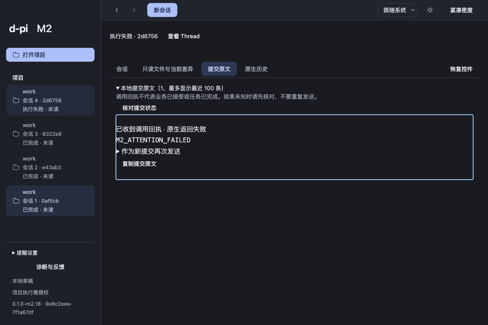

# 多 Thread 提醒交接

2026-10-06，从干净 `7c9e1fe` 继续 M2，本地分支 `codex/m2-thread-attention`。Main提醒投影与偏好、正式GUI和独立审查问题修复已实现；clean m2.18候选已交付，实际16项包内检查与ZIP同源核验通过。01c保持claimed，原生通知/窗口验收待Mac解锁。M2工程in-progress、用户认可pending，不push、不扩M3。

## 已实现行为

后台Thread出现待回答或失败，显示可点击应用内提醒和侧栏状态，不自动导航或抢焦点。正常完成默认只更新完成/未读；系统通知与完成通知均需用户明确开启。点击待答定位当前真实交互；失败定位同trace收据并展开，只有实际匹配收据时进入既有专注阅读，可恢复设置/编辑控件，原编辑器与草稿保留。过期点击查看当前状态，不替用户作答或重发。

Main复用实际RuntimeView/SubmissionReceipt；ACK、busy=false不作为完成。当前连接新问题产生新提醒身份，迟到终态失败可纠正完成；reload、暂时无窗口不把观察生命周期交给React。最多512项，超出表达覆盖缺口。偏好独立存于App SQLite，通知内容仅通用自有文案和六位Thread ID；不读取业务全文、秘密或OMP原生日志。

系统通知失败保留应用内状态，复用现有诊断trace；精确自有码notification-unavailable可脱敏导出。系统available只表达能力，不能证明OS许可或实际送达。候选未签名/公证；实际通知显示/点击另行观察，未以模拟或脚本发通知替代。

## 验证与限制

双轴独立审查、TDD证据见[评审](attention-review.md)与[原始过程](evidence/attention-tdd.md)。布局修复后完整pnpm check通过：795行为/34架构/74工具，2既有opt-in跳过，[原始检查](evidence/attention-layout-engineering-check.txt)。早期794行为结果保留；实际672afdc干净包16项通过后，截图又暴露失败详情裁切，已先红后修复。该旧候选与检查在[修复前包内结果](evidence/attention-macos-pre-layout/m2-result.json)，不充当替代包通过证据。

实机检查到达后台checkpoint后，Computer Use明确报告Mac锁定；已请求手动解锁、未收到确认，没有写observed/resume或模拟Notification点击。checkpoint五分钟真实超时，原始日志/DOM/截图及[原生记录](evidence/attention-macos-inspection-blocked/native-actions.md)保留。原生通知显示/点击、实际关窗/同App重开未验收，01c不能关闭。

实际SDK与localhost供应商隔离HOME、配置、App数据和项目，不调用个人认证或付费供应商。Chromium组合事件不等同系统IME。冷旧Thread保持只读、unknown不自动重发。PDF视觉/OCR、完整V1-00/B6负载/故障组合、真实供应商试用和用户认可仍开放。

## 最终候选与试用

| 项目 | 精确身份 |
| --- | --- |
| 产品源码 | `9a8c2eea41196b5584a46fcc575ed589a7cfe392` |
| Build | `0.1.0-m2.18 / 9a8c2eea-7f1a67df`，dirty=false |
| App | `/Users/louistation/.codex/worktrees/a613/d-pi/dist/attention-m2.18-clean/mac-arm64/d-pi.app` |
| ZIP | `/Users/louistation/.codex/worktrees/a613/d-pi/dist/candidates/d-pi-0.1.0-m2.18-macos-arm64-9a8c2eea.zip` |
| ZIP字节/SHA256 | 430118030 / `afd2e8bf271434a8285b5e9946cbe1084c4c0b3cc9f45f0e4a4e4d049d0bb49b` |
| app.asar SHA256 | `5034213a26540a99aa68824165f5f24e84614ce321e9809667eb1912c5221374` |
| 环境 | macOS arm64；Node24.21.0/pnpm12.8.1/Electron44.4.5（内嵌Node24.21.0）/Bun1.3.14/OMP18.4.6 |

从干净提交build/pack，交接更新后[check:fast](evidence/attention-delivery-fast.txt)通过；随后交接提交不改变这份产品身份；`git diff d272bd6..9a8c2ee -- src validation`为空，独立复核源码相同。App、实际受测含空格路径副本、ZIP中的app.asar一致，全部ZIP entry CRC通过：[机器身份](evidence/attention-package-identity.json)。[完整包内结果](evidence/attention-macos/m2-result.json)、[提醒细节](evidence/attention-macos/attention-result.json)、[原始日志](evidence/attention-macos/package-log.txt)、[build](evidence/attention-layout-build.txt)、[pack](evidence/attention-layout-pack.txt)。前两轮1a557225/672afdc候选ZIP和原证据保留，只以9a8c2ee包作当前试用候选。

最终执行`node validation/m2/package.mjs <clean-app> --attention`，16项检查通过。实际固定SDK extension产生待答，localhost HTTP400经SDK产生失败；没有注入假Runtime事件。实际应用内点击正确Thread/当前交互、同trace失败收据展开与焦点；失败状态行top284/bottom309.5完整位于有效可见区193–728，阅读区535px，截图实看可读。两并行原生scope、草稿/编辑选择/撤销、reload同Main实例与提醒ID不重发、默认完成静默/未读、主题/密度/语言/560px窄视口、实际冷启动通知偏好持久化/旧Thread只读同轮通过。供应商请求均为隔离localhost：基线2次、提醒2次。此轮未加原生inspect，不能外推系统显示/点击和真实关窗重开。

1. 启动上述App，核对侧栏build为9a8c2eea-7f1a67df。
2. 在已有可用配置下新建独立Thread A/B，让B产生待答或失败，再切回A；提醒不抢焦点，A的草稿保留。点提醒后进入B当前交互或失败收据，核对失败详情可读；专注阅读可点「恢复控件」。仅查看提醒不会回答或重发。
3. 查看侧栏完成/未读；在「提醒设置」明确开启系统提醒与可选完成提醒。available不是送达保证，系统失败仍可在App查看状态和按trace查诊断。
4. 用户自行核对真实供应商和日常工作流程；本轮隔离SDK验证不替代该试用，也不构成认可。

若继续01c，用户手动解锁Mac并确认后运行同一候选`--attention --attention-inspect`，实际观察后台不抢焦点、系统显示/真实点击、关闭窗口仍观察与同Main重开；系统不可用/失败按实际记录，不模拟回调。候选签名、公证不在本轮范围。01c/M2及用户认可保持开放。

