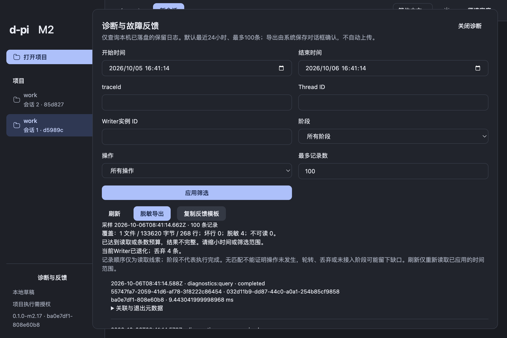

# 基础诊断导出与故障反馈交接

2026-10-06，从已 fetch 核实的 main/origin/main `1c9c30a` 继续 M2。06e/06f/06g 工程完成，M2 engineering in-progress / trial delivered / acceptance pending。父06、整体V1-00/B6及其它开放项保留；本轮只本地提交，未push、未公开发布、不扩M3。

## 已交付行为

侧栏和启动故障页提供「诊断与反馈」，启动故障与Thread错误可用同一trace快捷进入。面板查询既有Main JSONL，按开始/结束时间、trace、Thread、Main Writer实例、operation、stage与条数筛选；默认最近24小时、100条，最多500条。显式应用/刷新，展示采样时间、旧采样、类型化失败、坏行、脱敏、不可读、预算缺口及当前Writer退化/丢弃；不轮询、不自动重试。

只读扫描最多256目录项、12文件、8MiB、20,000行、64KiB单行，协作式时限1,500ms，每128行让出事件循环；不等待Writer drain。已知关联/状态/错误码按白名单保留，未知自由文本改unknown或剔除；不导出路径、URL、凭据、业务全文、原生会话或crash dump。保留receiptState与outcome两事实，不由阶段倒推完成或重放提交。

「脱敏导出」由Main原生保存对话框选择目的地，同一受限读取器重新采样，报告包含build/runtime、筛选、覆盖及unknown归因；最多2MiB，以0600独占临时文件写入后rename。等待期间复核当前源文档/frame身份，导航失效则停止。Renderer仅收到文件basename与类型化结果。

「复制反馈模板」复制受控元数据及复现/预期/实际占位文字。用户审阅、补充说明并自行提交；应用不上传反馈。关闭面板不影响业务生命周期，迟到结果不写入新scope；Escape返回入口焦点。

## 候选与验证

| 项目 | 精确身份 |
| --- | --- |
| 产品源码 | `ba0e7df1511b15932d293679959c2b594c3ea29c` |
| build | `0.1.0-m2.17 / ba0e7df1-808e60b8`，dirty=false |
| 本地分支 | `codex/m2-diagnostics`；后续harness/交接提交不改此包的产品身份 |
| App | `/Users/louistation/MySpace/Life/d-pi/dist/diagnostics-m2.17-clean/mac-arm64/d-pi.app` |
| ZIP | `/Users/louistation/MySpace/Life/d-pi/dist/candidates/d-pi-0.1.0-m2.17-macos-arm64-ba0e7df1.zip` |
| ZIP字节/SHA256 | 430108608 / `965ee8a486e5266fb2a4e09d9034c4f649c465c474f88419ef8efdf237a5d69a` |
| app.asar SHA256 | `dbd6409c9228869524ecea416f5348e9e2c4942391391a423ab6362d77cf4a4e` |
| 环境 | macOS arm64；Node24.21.0/pnpm12.8.1/Electron44.4.5（内嵌Node24.21.0）/Bun1.3.14/OMP18.4.6 |

clean独立checkout准备frozen依赖、Electron与SDK，经[环境门禁](evidence/diagnostics-environment.txt)后build/pack。候选未签名/公证。本地App、实际受测副本及ZIP中的app.asar哈希一致，ZIP所有entry CRC通过，[机器身份](evidence/diagnostics-macos/package-identity.json)。包装副本采用含空格路径并隔离App数据、HOME、OMP/Git配置与localhost供应商；未读取个人凭据、未调用付费真实供应商。

完整 `pnpm check` 通过：751行为、34架构、74工具；2项既有opt-in跳过，类型/设计/i18n/文档/结构/看板门禁通过；交接更新后的 [check:fast](evidence/diagnostics-final-fast.txt) 通过。[原始检查](evidence/diagnostics-engineering-check.txt)、[TDD过程与保留失败](evidence/diagnostics-tdd.md)、[两轴独立评审](diagnostics-review.md)。首次SSR失败已修复；实际Node SQLite错误码先失败回归后保留。Reader 11项与既有Writer 2项、GUI 10项、Main/preload 7项关键行为覆盖包含真实文件/导航/并发/失败及React scope/focus边界。

执行 `node validation/m2/package.mjs <clean-app> --diagnostics --diagnostics-inspect`，最终21项实际包内检查全部通过。[完整机器结果](evidence/diagnostics-macos/m2-result.json)、[诊断细节](evidence/diagnostics-macos/diagnostics-result.json)、[原始日志](evidence/diagnostics-package-log.txt)、[原生操作](evidence/diagnostics-macos/native-actions.md)。主要新增证据：

- 实际固定SDK提交trace `db527103-294b-484b-a968-062b80e301e4` 对应prepared/dispatching/acknowledged，Thread、Writer真实身份及两种收据事实可读；2次请求为隔离localhost供应商。
- 标明synthetic的坏行/秘密/路径/URL/自由内容样本由真实包内桥接和读取器筛选/脱敏；不冒充供应商错误。9MiB超长行样本扫描8388608字节、251.56ms，GUI显式显示覆盖不完整。
- Computer Use操作实际macOS保存和取消对话框：报告3426字节、0600，SHA256 `962663b3b94aa58a40726d76eee99fa7f945f380c3830a5637e060e1bd46c233`；取消显示未保存并保留先前报告。[脱敏报告](evidence/diagnostics-macos/diagnostics-export.json)。
- 真实包内Copy写入661字符模板，内容hash核验且原剪贴板restored；主题/密度/语言切换保留查询，560px Chromium窄视口无横向溢出，trusted Escape回焦点。
- 隔离日志路径真实EEXIST故障触发原生Writer警告，人工检查并关闭；应用仍可操作，既有日志保留，恢复路径后读取显示degraded=true/dropped=4。没有修复/删除业务数据库。
- 独立损坏SQLite启动保留原文件、全局诊断及同一失败trace快捷入口；Main既有记录可读。暖双scope/刷新无重发与冷旧Thread只读基线同轮通过。

首次包内harness在自动采样未结束时应用第二scope，被Main正常拒绝busy，脚本却只等待成功；原失败日志与DOM保留。`49cfaa3` 仅先等待初始采样结束，两轴独立核对未放宽预算/断言，仍使用相同clean产品包完成最终运行；详情见[TDD记录](evidence/diagnostics-tdd.md)。

读取器单样本8MiB测量248.21ms、RSS增加约8.4MiB、heap约146KiB、external约63KiB、文件句柄残留0；扫描中Writer仍持久化20条。见[原始测量与红绿](evidence/diagnostics-reader/README.md)。这不是完整B6 A/B性能结论。

## 试用步骤

1. 启动上述App，确认侧栏版本/build；点「诊断与反馈」。无需项目执行授权即可读App日志。
2. 选择时间范围，可粘贴错误trace或Thread/Writer UUID，选阶段/操作/条数后「应用筛选」。检查采样时间和覆盖；「刷新」读取同一已应用时间范围，需要最新时间则修改结束时间并重新应用。
3. 点「脱敏导出」，在macOS对话框选择文件并保存；也可取消，界面分别显示明确结果。保存重新采样，可能比屏幕旧快照多出日志。可查询导出操作自身trace。
4. 点「复制反馈模板」，审阅并补复现、预期和实际表现，附脱敏JSON后自行提交。故障页的「查看此故障诊断」直接带入故障trace。

读取中切换scope可能得到可恢复busy；等前次完成后手动刷新。无匹配不证明操作未发生；轮转、未落盘、丢弃、未接入阶段均可能有缺口。当前Writer状态不代表历史所有进程健康；无span/seq严格跨进程时间线，根因未证实保持unknown。协作时限不能抢占未返回的系统文件I/O。

完整V1-00/B6启停A/B、3Thread/10000消息/30分钟负载、故障全集、系统IME、真实供应商试用和M2其它开放能力未被本轮覆盖。用户认可pending，工程完成和实际候选不代替认可。

