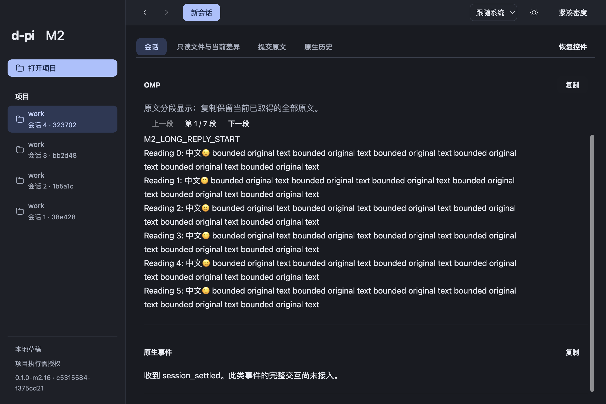
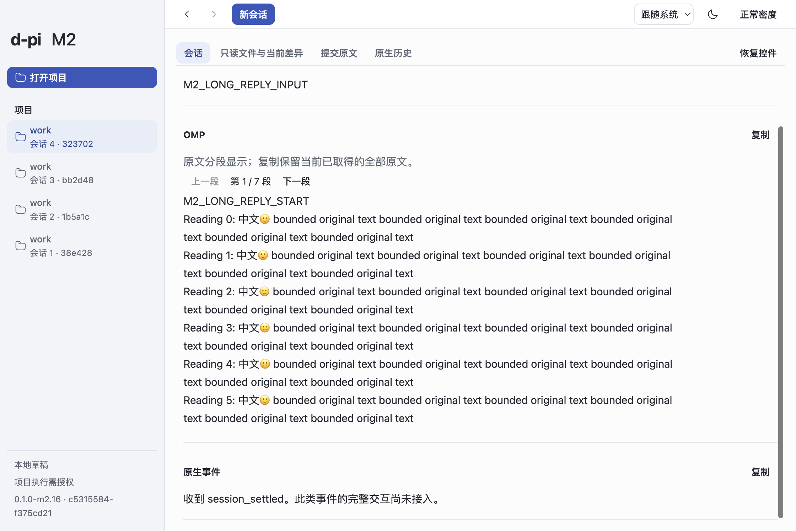
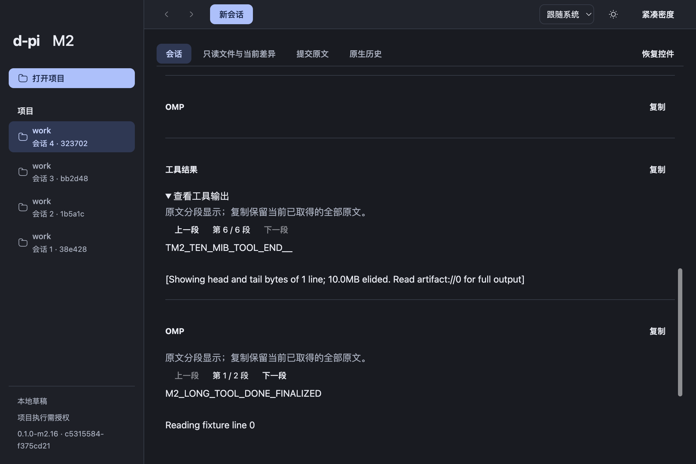

# M2 有界长正文阅读交接

2026-10-06，06c/06d工程完成，交付本地macOS arm64 `0.1.0-m2.16`候选。实时消息、原生历史和子Agent结果共用有界原文阅读：短内容沿用原有表示，长内容显式分段，每段最多8192 UTF-16 units或120行，只挂载当前段，阅读容器高度有界。上一段/下一段可通过键盘操作，复制保留当前已取得的全部原文。

流式追加保留已封闭段DOM、文字节点、选择与段内滚动，不自动翻页；当前增长末段可以更新。Thread、Host generation、历史来源或记录身份变化隔离页码，同Host重连保留。没有增加第二份正文事实、修改OMP历史或放大Host预算。

## 候选与验证

| 项目 | 固定身份 |
| --- | --- |
| 本段起点 | `df41925401d6f64cfe4ea73432ca00523f7a5a94` |
| 产品源码 | `c531558406e3c3b7da4544be8df55fe92d40530f`，分支`codex/m2-lifecycle` |
| 实际构建 | `0.1.0-m2.16 / c5315584-f375cd21`，dirty=false |
| 验证harness | `3fdb25f5c96f8b126d9b75fcbb1eaa7e8198dd6e`；产品构建后仅修改验证与记录 |
| App | `/Users/louistation/MySpace/Life/d-pi/dist/long-reading-m2.16-final-clean/mac-arm64/d-pi.app` |
| ZIP | `/Users/louistation/MySpace/Life/d-pi/dist/candidates/d-pi-0.1.0-m2.16-c531558-mac-arm64.zip`，430094907 bytes |
| ZIP SHA-256 | `c9d4adbfc76ca1f8c7a0af8719c861231a5e8d43e783875f459cfeeb06d797a7` |
| App及ZIP内app.asar SHA-256 | `69b24c046a884c3d2b9aec7efa678cfa0209dd437c710a16f66aff8b2cfb37c8` |

独立干净checkout安装锁定依赖并构建，Node24.21.0/pnpm12.8.1/Electron44.4.5/Bun1.3.14/OMP18.4.6；环境/资源门禁、build、打包、ZIP CRC与流式app.asar同源核对通过。[身份记录](evidence/long-reading-candidate-integrity.json)、[CRC摘要](evidence/long-reading-zip-integrity.txt)。未签名/公证，仅本地交付；未push或创建远端PR。

产品source完整`pnpm check`通过723行为、34架构、70tooling及六类型、设计/i18n/文档/结构/状态门禁；两个既有opt-in跳过（原生CLI artifact和引用benchmark）。新增11条阅读与1条Main权限行为；[逐行为红→绿](evidence/long-reading-tdd.md)、[完整检查](evidence/long-reading-engineering-check.txt)、[双轴评审](long-reading-review.md)。整体M2仍in-progress/trial delivered/acceptance pending。

## 实际包内证据

隔离HOME、App数据、OMP配置、项目、Git配置及localhost supplier，未使用个人账户/凭据或真实供应商付费请求。实际Electron固定SDK运行21项检查：[机器结果](evidence/long-reading-package-result.json)、[运行日志](evidence/long-reading-package-log.txt)。最后运行数据根`/private/var/folders/0_/wqjm38lj5j5frqmvd7c4m5yh0000gn/T/d-pi-m2-package-9twqGK`保留native数据与截图。

- 真实回复复制40784 UTF-16 units，包含未显示段和finalization；七段重构与所复制原文精确相等，SHA-256 `3c591fdf2ca6199517e27653c2d2f75fc5a2f99910c1a5accfa187b90a93eec9`。实际鼠标Copy、键盘Enter翻段、已封闭段选择/scroll稳定、Thread隔离、Renderer reload无重发及原生历史分段通过。
- 原生工具生成10485760 bytes artifact，SHA-256 `d7338b6e19f80b4ddad7f6e013149b41d9c58198fca52233e12371e9d4a89cb2`。固定SDK在到达Host前执行middle truncation，当前取得41077 UTF-8 bytes（41073 UTF-16 units），六段重构与原生取得正文相等。首工具段8192 units，高336.59 CSS px；末段保留SDK省略量和`artifact://0`。这里证明10MiB原生artifact及所得头尾阅读，不能证明Host/Renderer承载完整10MiB。
- 双Thread/独立草稿/模型、两次同名原生子Agent独立运行及完成结果、切换壳连续性、暖重连、七日附件回收与冷旧Thread只读仍通过。Chromium composition/Shift+Enter通过，未操纵macOS系统输入法。
- 深色常规、浅色紧凑与工具末段截图已实际检查。修正工具取景后再次完整21项通过；旧离屏截图仅保留于本地历史证据，不用作可见缺口证明。

## 实际Copy缺陷与验证工具修复

首版clean包真实Copy失败：`NotAllowedError / Write permission denied`。Main窗口统一拒绝权限，阻断既有`navigator.clipboard.writeText`。先失败回归，再仅允许当前WebContents、主框架、当前文档的`clipboard-sanitized-write`，check/request双入口一致；读取、其他权限/contents、子框架和不同URL仍拒绝。31项窗口/Main启动/安全集成及最终实际Copy通过。[真实失败](evidence/long-reading-copy-permission-red.txt)、[回归红灯](evidence/long-reading-window-permission-tdd-red.txt)、[绿灯](evidence/long-reading-window-permission-green.txt)。无新增数据库或执行权限。

验证工具使用有界AppKit多格式快照（16MiB，0700目录/0600文件），复制及恢复前核对原始/本工具拥有的快照和changeCount，用户新复制则保留。修复独立review指出的未拥有同内容hash恢复路径；命名pasteboard八场景/残留0，实际最终运行`clipboardRestoration=restored`。日志不含用户剪贴板内容。[辅助验证](evidence/long-reading-clipboard-final.txt)。NSPasteboard无CAS，最后核对到写入之间窄窗口不承诺绝对原子。

隐藏窗口rAF不保证帧，曾使harness等待停滞；改为等待实际分段DOM提交，每次CDP请求30秒超时并清理计时器。[观察](evidence/long-reading-hidden-frame-probe.json)。没有修改产品渲染策略。

## 试用与范围

1. 解压ZIP并打开App，确认左下角`0.1.0-m2.16 · c5315584-f375cd21`。使用已有可用配置，在授权项目中新建独立Thread。
2. 请求较长中文/代码回复，看到“原文分段显示”和页码后用鼠标及Tab/Enter翻段；复制到编辑器核对其他段和结束文字。
3. 流式返回时，在已封闭前段选择并滚动，继续追加应保留位置。切换Thread、暖Renderer重连、历史及子Agent结果分别核对身份和页码隔离。
4. 展开长工具输出，翻末段查看原生覆盖/省略提示；切换主题/密度检查阅读、翻段和Composer可达。冷重启旧Thread仍只读，继续执行需新建独立Thread。

已封闭段保留不覆盖短Markdown转长原文的表示切换，也不阻止当前末段增长。复制仅含模型已取得原文，SDK/Host/历史缺口不会补全。纯分段成本测量不代表GUI性能全集；3Thread/10000消息/30分钟、系统IME、慢盘/故障全集、PDF完整视觉/OCR、退出放弃队列待决及真实供应商试用仍开放，用户认可pending。

本段为Renderer阅读与窄范围Main写权限修复，可回退对应代码，未新增schema/config迁移。累计分支此前schema10和私有文件清理的one-way边界由[生命周期交接](lifecycle.md)维护，不能靠本段git revert撤销。其他交互策略worktree未混入候选。
