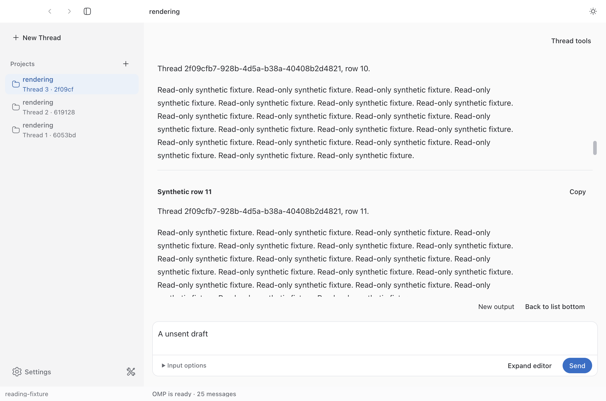
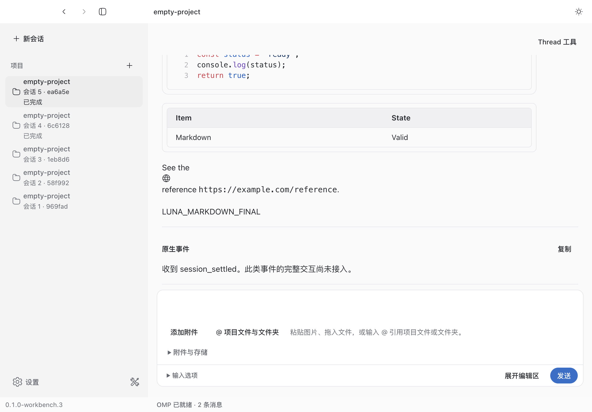
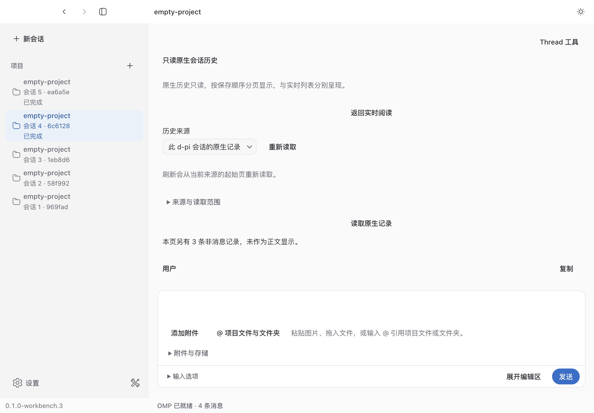
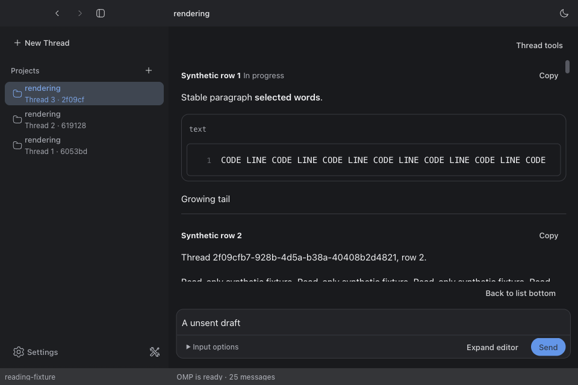

# 首个长会话阅读闭环交接

日期：2026-10-07–08。所属 [spec](spec.md#2026-10-07-首个长会话阅读闭环本轮授权)，leaf 06h/06i/06j。本轮工程与实际 Dev 试验完成；用户认可仍 pending，M2 父范围未整体关闭。最终本地合入与远端核对另记录在本文末尾。

## 基线、研究与本次改动

用户附件《D-PI 长会话研究与实现蓝图》是研究材料；实际授权来自当前请求。蓝图固定 d-pi `7906f255`，开工实际干净 main `6daf80ee25d8c45e03cb8ab1c8d7304f926ee187`，保留其后 Thread tools Modal、独立阅读区和 Composer dock。原 main 领先 origin/main 的 10 个提交保留。收尾又合入并复核其它会话的 `5a89a20` 窗口控件对齐与 `5dc8f65` 菜单 pointer/focus 修复，未重置用户 checkout。

直接核对同级 T3 Code 实际 `611132c171f3a821bd2e32f22261135cef6330ac` 的 ChatView 导航/取消路径，实际版本不同于蓝图 nightly `10f39…`。借鉴用户输入优先、取消待发定位的责任边界，没有复制三态播放、动画队列、框架或历史合并模型。安装源码和锁文件固定 Streamdown 2.6.0、@streamdown/code 1.1.1；对照 [Streamdown 官方功能说明](https://github.com/vercel/streamdown/blob/main/skills/streamdown/references/features.md)及真实组件验证完成态，实际行为以锁定源码和测试为准。

| 已有资产 | 本轮补齐 |
| --- | --- |
| Thread ReadingPositions、来源/generation、内容 row anchor、32 source / 128 body 账本 | 显式回底、atEnd 小型订阅、外层输入接管同一适配器、attention 定位提交 |
| 8192 UTF-16 / 120 行 raw 分段及段内位置 | 手动“最新段”；追加保留旧段，外层回底也保留旧段 |
| 分开的 live/native 视图、历史 Query attempt | live gap/截断入口、现有工具 Modal 导航、只读范围/起始页刷新说明、返回 live 与可见焦点 |
| Streamdown 和代码插件 | 最终态保持 Block 树、关闭 incomplete 补写；迟到引用/脚注统一短文解析范围，代码保留 pre 横向滚动 |

新输出提示只针对当前可见来源的一次阅读期间；同一实体正文变化和新实体都能置位，相同快照、loading、收据/完成元数据不计入。回底/已跟随清除，切源/Thread/重新进入重建基线，没有持久未读计数。回底说明当前 live 已保留尾部，不补 gap，不表示当前 raw 最新段或全文已读。

Main/Host/Bun 执行、原生历史所有权、unknown 不重发、冷恢复只读，以及 8MiB / 1000 项 / 32ms 投影预算保留。没有升级依赖、引入库、猜 live/native 对应或扩大缓存。工具/思考内部样式保持现有简单结构。

## 固定源码与验证层级

- 最后生产阅读修复 `fe170c06e697f4aac36bd78151235d8db778a0fe`（历史导航返回可见工具焦点）；此前 `3974e7159436e66fc6daecb53d22f1815743ac1a` 修复新来源首帧前用户接管。后续 fixture 校准与 main 合并不改阅读生产行为。
- 合并最新 main 的完整检查 source：`7e16f9921de6732f8ab696a924e2c57bb3cc39ca`。
- 精确 synthetic Electron 探针 source：`d987f98`，启动时工作区干净；实际完整 SHA d987f98a8cd7aafb432ab51f15244e8b04ccb618、dirty=false、24项通过及性能样本以 [result.json](evidence/reading-loop/result.json) 为准。使用生产 App/Thread 模型、组件、Query、真实 Chromium，但桥接是隔离 fixture，没有 Main/provider 历史 I/O。
- 真实 provider / pnpm dev source：`c04e245941a8df7a4f882ffcde46082b6d0eb816`；Dev 曾经 HMR，属于工作源码试验，不冒称固定包/asar/签名候选。其生产阅读代码与上述组合一致；主干窗口/菜单增量另经复审和合并后 synthetic 验证。

## TDD 与必要修复

新增最新段入口、最终 Markdown 前缀节点身份首先失败，最小实现后通过。保留 Block 树后真实迟到引用语义失败，再修统一短文解析范围；escaped `]` label 的原始红灯保留。前缀身份测试首次失败即退出，不能称后面的 Range/代码滚动断言各自也观察到红灯。前三项当时红灯仅在工具输出与 worker [摘要](evidence/reading-loop/logs/body-evidence.md)，未有独立原始日志，不补造。

独立 Spec review 复现：新 source/generation 已提交、首个 restore rAF 尚未执行时，用户外层 wheel 的 190px 会被下一次 resize 恢复到 0。红绿 [source-red.log](evidence/reading-loop/logs/source-red.log) / [source-green.log](evidence/reading-loop/logs/source-green.log)；显式输入采用当前 DOM 来源，普通迟到 scroll 不借机采用新来源，保持两种因果不同。

真实 Electron 首次 history 入口使原 gap 按钮隐藏，Modal 关闭后焦点无法返回它，见 [focus-red.log](evidence/reading-loop/logs/focus-red.log)。统一返回始终可见的 Thread tools 按钮，后续真实合成探针与真实 Main/provider 历史返回均验证。

真实代码长行探针发现全局 pre-wrap 使 fenced code 无横向位置；局部使用 pre/normal 保留代码空白，实际非零 scrollLeft 与完成态保持通过。attention 旧恢复盖掉定位、末尾钳制后的继续跟随、原生历史尚未读/访问拒绝误作空列表也有行为红绿。既有 raw/账本/attempt 正确行为补回归，不伪造产品红灯。live worker 的原始红绿工具输出选摘保存为 [live-worker-tool-outputs.json](evidence/reading-loop/logs/live-worker-tool-outputs.json)，包含原有输出截断及原始行号，不冒称完整日志。

完整检查发现基线三个 UI fixtures 滞后于工具 Modal / locale context，及 Disclosure mock、TS this 和共享尺寸 token 门禁问题；保持原值、真实业务订阅/保存次数断言，最小校准，不关闭门禁。Dev 与 PDF 原生测试共用 SDK 排他 guard 时出现 database is locked，停止本轮 Dev 后完整检查通过；未删除 guard、放宽锁或修改 PDF 产品逻辑。

收尾 synthetic 探针曾只等三个 rAF，离尾提示一次缺失，随后 R2 通过但原生 Copy 异步完成前 hash 检查失败。现等待离尾按钮/新提示的实际提交、验证原生 pointer 命中并等 hash/ownership 完成；保留锚点误差断言。旧提示失败只有 assertion undefined、原 result 已被随后运行覆盖，不能据此断言或排除生产竞态；没有因它新增生产状态。保留 [copy-wait-failure.log](evidence/reading-loop/logs/copy-wait-failure.log)。

## R1–R15 验收映射

以下是蓝图首版矩阵的工程覆盖，不声称穷尽所有 GUI、OS 或提供用户认可。

| 场景 | 自动化与实际证据 |
| --- | --- |
| R1 live 尾部继续跟随 | reading-anchor、live-reading；Electron 同实体追加仍在尾部 |
| R2 离尾追加/上方内容/宽度变化 | anchor row-relative 恢复、conversation-loop；Electron row10 偏移误差≤2px且有新输出，宽度变更保持 |
| R3 用户取消已排 restore | wheel/键盘/scrollbar/native scroll 接管、嵌套消费；新增 source 首帧红绿 |
| R4 回底与较新用户/隐藏/来源 | reading-anchor 即时回底及取消、后续跟随；dispose/隐藏/新源回归 |
| R5 A→B→A / generation | live-reading baseline 与 reading-position；Electron source、旧段、外层位置返回，新 generation 清零不串提示 |
| R6 closed raw 段 | bounded-reading-renderer 真节点/Range/段内滚动；Electron 追加保持同节点与选区 |
| R7 短文最终 Markdown | 真实 Streamdown/code tests：节点、选区、代码位置、引用/escaped label、脚注/表格/围栏/最终尾文/中断原文、static 语义对照；Electron 稳定前缀及横滚，真实 Luna 最终文 |
| R8 gap→native→live | history-loop / thread-workbench；Electron saved-order 部分覆盖和旧 live 位置/段返回；真实 Main 读4条、略去3条非消息后返回 |
| R9 旧 attempt 成功/失败迟到 | bound-history-attempt：新重试 busy 中或已完成前后四种次序，旧 Query 不夺数据/繁忙归属 |
| R10 changed/missing/denied/empty | history-loop、bounded-history 与 native-history 合同；Electron changed 和刷新起始页，拒绝发现仍能使用已绑定读取入口 |
| R11 隐藏/卸载/关 pane | adapter 取消帧、断开观察/监听，不接受迟到命令；Thread 账本保留，fixture root 真卸载 |
| R12 键盘/IME/嵌套滚动/复制 | keyboard/IME 编辑目标不接管、raw 键盘可达；Electron Cmd+C 真实选区复制、全1,410,941字符复制并恢复所持有剪贴板 |
| R13 Modal/Composer | 真 React/工作台集成；Electron/editor identity 不重建、历史导航与返回可见工具焦点；真实 Main 返回也焦点正确 |
| R14 数百段与两种位置 | 约300段 fixture；外层回底保持旧段，最新段按有效末段选择，随后追加不翻页 |
| R15 离开返回段页/段内 | bounded-reading-renderer 卸载重挂/不同来源隔离；Electron A→B→A及历史返回旧段/偏移 |

核心测试落点：`src/app/renderer/reading/{reading-anchor,live-reading,reading-pane,conversation-loop,bounded-reading-renderer,markdown,history-loop,bounded-history}.test.ts`，`src/app/renderer/workbench/thread-workbench.test.ts`，`src/modules/conversation/core/{reading-position,bound-history-attempt}.test.ts`。生命周期由 Thread 拥有而非 React；UI 不新增持久正文事实。

## 检查与真实 UI

`pnpm check` 在最新 main 组合通过：183 文件通过、1 文件跳过，1062 行为测试通过、2 测试跳过；架构35、工具96；类型/格式/设计/i18n/边界/文档/结构/状态门禁通过。既有跳过分别是需 D_PI_NATIVE_SMOKE 的完整 native CLI smoke，以及需 D_PI_REFERENCE_BENCH 的项目引用10k条目性能基准。实际环境检查核实 Node24.21.0、pnpm12.8.1、Bun1.3.14、Electron44.4.5、OMP18.4.6，锁文件不变。[完整检查日志](evidence/reading-loop/logs/check-merged.log)。合并后 `pnpm build` 通过，保留既有大chunk警告；interaction / fast 检查结果见交付记录，未把 lint 的通过当视觉认可。

实际 `pnpm dev` 使用本轮隔离 App 数据、沿用现有 OMP 认证和 `openai-codex/gpt-5.6-luna high`。两个新 QA Thread、三次限定请求，无工具/文件动作。A 收到6595字符/141行和8817字符/221行，B 收到代码/表格/引用325字符最终文；全部收据 acknowledged/completed，与 native message、stopReason=stop 一致。[provider.json](evidence/reading-loop/provider.json) 保存受控身份、hash、标记，没有凭据/思考全文。

实际 A 运行时新建 B，A 背景完成仍在原 Thread；切回 A，旧 raw 第2段（zero-based1）在另一回复追加后仍保留，可手动显示新末段。工具历史真实只读4条 user/assistant，返回 live 同 generation/source、top0/旧段1，焦点在工具按钮；回列表底部 top962 / scrollHeight1397 / viewport435，旧段1仍保留。[返回](evidence/reading-loop/provider-return-live.json)、[回底](evidence/reading-loop/provider-after-bottom.json)、[最终 Markdown](evidence/reading-loop/provider-markdown.json)。首次非规范项目导致准备失败，通过正常项目入口选择 canonical 路径后新 Thread 成功；Dev 重启后的旧 Thread 按现有冷恢复只读，未伪造 ready 或重发。

synthetic fixture 1000 retained 短条目输入→下一帧采样20次，P95=8.5ms、7660节点，全部样本见 result；这是限定输入延迟抽样，不是10k/heap长稳或端到端 token 延迟。macOS 原生选区复制及完整正文复制已做，快照仅在拥有该次写入时恢复，发生其它用户写入则保留。Dev 在响应和 UI 验证结束后退出，避免 SDK guard 与原生测试竞争。

## 实质边界

真实 provider 的物理滚轮与流式追加重叠尝试未得到可断言的外层移动证据，不将它列为实际 race 通过；相关交错由 TDD 与真实 Electron synthetic 更新验证。VoiceOver、系统中文 IME 操作、物理惯性/滚动条拖动、非 macOS、完整10k/长时间内存压力、本轮固定包/签名/公证均未实测。冷恢复执行依然只读，本轮不改变认证/执行信任。

迟到引用/脚注改变语义作用域、Markdown 越阈值转 raw、组件卸载重挂不承诺 DOM/Selection 永不变化；重挂只恢复来源/段页/段内位置。live/native 分源、已保留尾部、历史 append-order 和刷新起始页都是公开边界。用户验收 pending，其他 M2 系统通知/附件等能力不由本轮关闭。impeccable detect 本轮一次通过且无输出；设计上下文仍提示既有设计文件新鲜度，未顺手修改该无关资产。

## 复审与交付

独立 [Spec/Standards review](reading-loop-review.md)；[本地 PR body](reading-loop-pr.md)。本地 PR 合 main 与 push 必须核对实际目标端后补记，不能用计划或工程通过代替。
