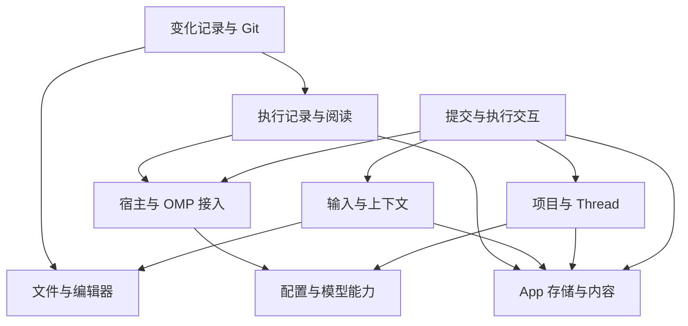

# 模块地图与设计入口

日期：2026-09-27。状态：模块职责设计；S1 项目与持久草稿已实现，工程验证与用户试用状态见 [S1 交接](../../../.scratch/m1-s1-project-draft/handoff.md)，其余模块按切片推进。模块边界可随有证据的实现反馈调整，变更已确认决定仍按[决定登记](../../decisions.md)处理。依据 D-02–D-16、D-20–D-35；全量目标和阶段以[基础方案](../../../.scratch/product-requirements/foundation-plan.md)为准。

本目录把已有合同落实到模块：谁拥有状态、向谁请求能力、怎样交接、失败后由谁恢复。它不另建一套产品规格，也不要求一个模块对应一个包、类或进程。近期深入 M1，M3 模块只确定能独立理解的边界及启动条件。

## 从哪里开始

- 开发一个模块：读该模块页、它列出的合同与直接依赖；无需通读全部模块。
- 接跨模块功能：再读[交接与时序](flows.md)，确认交接方、结果和失败归属。
- 开始基建和 M1：读[开发准备与切片计划](../../../.scratch/development-foundation/spec.md)，从当前切片的未知项和可用证据开始。
- 评审本次设计：先看本页的所有权表，再看提交/重连时序，最后按切片验收检查对应模块。图是文档中的 Mermaid 源码，GitHub 可直接渲染；表格保留相同语义。

## 模块清单

| 模块 | 本模块负责 | 当前设计深度 / 下一阶段 |
| --- | --- | --- |
| [宿主与 OMP 接入](runtime-host.md) | 进程监督、受限通道、协议解码、原生请求关联、实例恢复 | M1 核心；不重建 OMP 执行循环 |
| [App 存储与内容](app-storage.md) | SQLite 写入、迁移恢复、私有内容文件及引用一致性 | M1 核心；驱动和具体表结构在持久化切片确定 |
| [配置、模型与认证](configuration.md) | 原生配置复用、配置上下文、模型能力、新用户认证 | M1 已有配置；M2 两条新增认证与子 Agent Thread 配置覆盖 |
| [项目、工作目录与 Thread](threads.md) | 稳定身份、目录关系、执行准入、原生记录绑定与恢复入口 | M1 数据模型；M2 多 Thread 界面 |
| [输入与上下文](input-context.md) | 编辑接入、草稿、引用、内容准备与冻结 | M1 文字/选区；M2 全部指定输入 |
| [提交与执行交互](execution.md) | 提交收据、接受证据、排队/干预/停止和待答交互 | M1 核心；M2 完整队列管理 |
| [执行记录与阅读](conversation.md) | 会话投影、实时尾部、历史分页、工具/子 Agent 展示、复制 | M1 主链路；M2 长输出；M3 PNG 导出等 |
| [文件与编辑器](files-editor.md) | 授权读取、文件版本、Monaco 和选区；后续编辑/语言服务 | M1 只读；M3 编辑 |
| [变化记录与 Git](changes-git.md) | Git 状态与对比基线、工具修改证据、Diff 业务输入 | M1 只读；M3 Git 写入与完整变化管理 |
| [Side Chat](side-chat.md) | 独立问答、上下文快照、只读工具、显式同步和回送 | M3 边界；实际只读能力需先验证 |
| [内置浏览器](browser.md) | 预览、标签页、共享持久登录与后续 AI 操作 | M3 边界；不阻塞首版登录 |
| [集成终端](terminal.md) | 用户终端会话、进程、输入输出和释放 | M3 边界；不接管 OMP 工具命令 |

所有模块都遵守[无头功能合同](../headless-features.md)：规则、协调、查询投影、React 绑定和视图按实际需要分工。模块的业务逻辑不因页面卸载而结束，DOM/编辑器等视图资源则应及时释放。

## 核心模块的主要能力依赖

箭头表示左侧使用右侧能力或已确认数据，不是进程通信方向、事件传播方向或强制实施顺序。回调和结果返回不构成反向代码依赖；在相应作用域组装窄接口。这里只画影响拆分的主要依赖，具体交接见各模块页。

后续组合点：Side Chat 复用输入、执行和阅读，但必须先具备独立、可执行的只读能力约束；浏览器/终端从工作目录上下文取关联信息，各自拥有资源生命周期。这些不要求现在实现通用 Agent 平台。

## 一项事实只有一个权威拥有者

| 事实或资源 | 业务拥有者 / 运行位置 | 其他模块怎样使用 |
| --- | --- | --- |
| Agent 执行、真实队列、工具、原生历史与记忆 | OMP | 宿主接入读取/操作原生能力；App 不能以镜像覆盖原生事实 |
| Host/OMP 进程及连接身份 | 宿主模块；Main 监督 Host，Host 监督 OMP | Thread 关联实例，执行/阅读消费身份与事件 |
| Thread、目录关系、项目执行信任、App 文件授权 | Thread 模块 / Main | 存储模块落盘；实际操作方在可信宿主复核，界面缓存不授予权限 |
| 原生配置与凭据 | OMP 原生实现；配置模块适配 | 其他模块只取一致上下文和必要摘要，SQLite 不复制凭据 |
| 编辑正文、选区、撤销 | 输入模块的 Tiptap 实例 / Renderer | 通过版本化草稿 DTO 保存；React 不再维护第二份可写正文 |
| 持久草稿、附件准备和冻结内容包 | 输入模块 / Main 的功能协调 | 存储模块提供事务与文件能力；提交只能引用冻结版本 |
| App 提交收据 | 执行模块 / Main | 存储模块落盘；Host 派发和 Renderer 草稿清理以持久结果为依据 |
| 待答交互与命令接受判定 | 执行模块的 Host 协调；唯一 RPC 关联表由宿主适配承载 | 阅读模块投影，视图发出回答意图；不另造请求表或可写交互状态 |
| 显示投影、增量序号与快照水位 | 阅读模块 / Host | Renderer 订阅镜像；有界补充持久化走 Main |
| 文件当前内容 / Git 当前状态 | 文件系统 / Git | 文件、Git 模块返回来源和版本，缓存不成为另一份磁盘真相 |
| 数据库连接、迁移、文件落盘与回收 | 存储模块 / Main 管入口与调度 | 各业务定义状态合法性；存储模块不决定 OMP 接受或产品 Run |

## 共同基础的落点

| 能力 | 集中维护的位置 | 首条链路怎么落地 |
| --- | --- | --- |
| 权限与信任 | [基础契约 §5](../foundation-contracts.md#5-最小权限与信任b5) | Thread 管授权记录；文件/启动/配置等操作入口各自执行所需检查。App 读取与项目执行为两个独立设置 |
| 类型与数据边界 | [TypeScript 合同](../typescript.md) | 公开业务 DTO 可序列化，schema 推导类型；边界用 Zod v4，可信内部不重复 parse；业务分支用 ts-pattern 穷尽处理 |
| 错误与诊断 | [诊断合同](../diagnostics.md) | Main 管设施；操作拥有者决定恢复；实际跨进程路径传同一 traceId，日志失败不改业务结果 |
| UI 组合 | Base UI / 自有组件 API、[图标合同](../icon-system.md) | 薄绑定组合功能，Tiptap/Monaco 留在所属适配层；按[设计系统合同](../design-system.md)统一 token、主题/密度与组件覆盖边界，S1 起设计 lint；布局、焦点和面板不拥有后台任务 |
| 构建与质量检查 | [M1 计划](../../../.scratch/development-foundation/spec.md) | 单应用，按切片接入严格 TS、Biome、行为检查与 macOS 包验证，不先搭通用框架 |

## 设计完成到什么程度

模块页写清范围、所有权/生命周期、输入输出、失败处理及当前验收；依赖通过链接可追到提供方。共用的预算、错误字段和决定不复制多份，具体方法签名、SQL 表和内部类等到实际切片需要时确定。

有价值的边界检查保留，例如数据来自外部、资源授权、版本冲突和结果未知；不为可信内部函数层层兜底，不用自动重试或默认成功掩盖失败。当前 G1 未知项只阻塞受影响切片，远期细节和完整 TUI 盘点不阻塞 M1。
