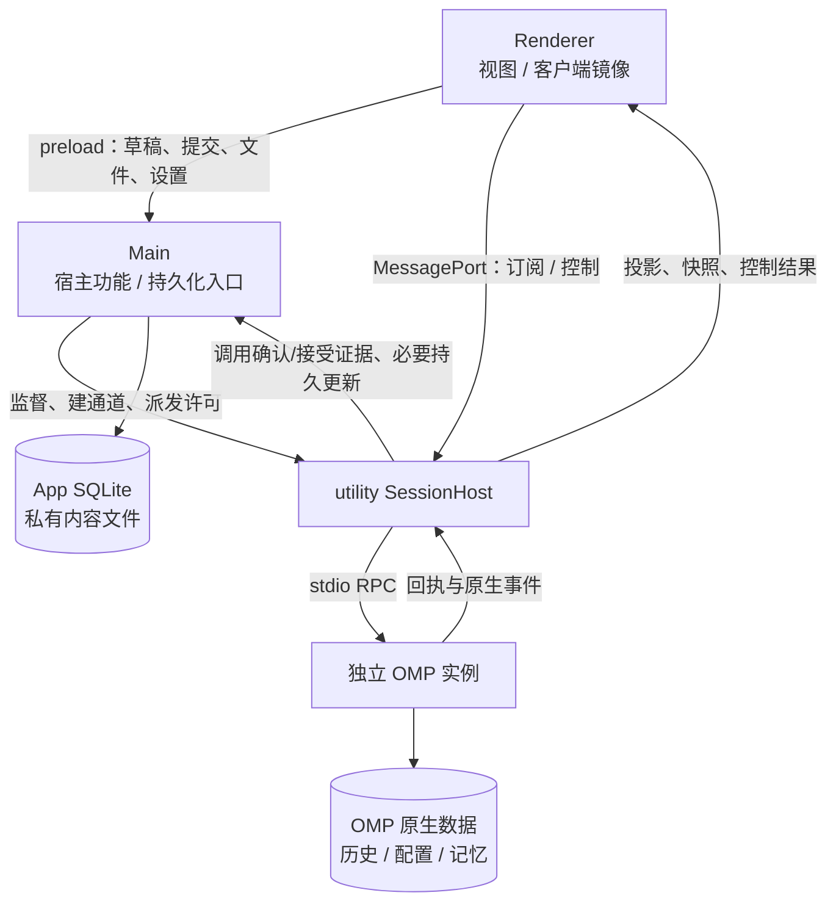
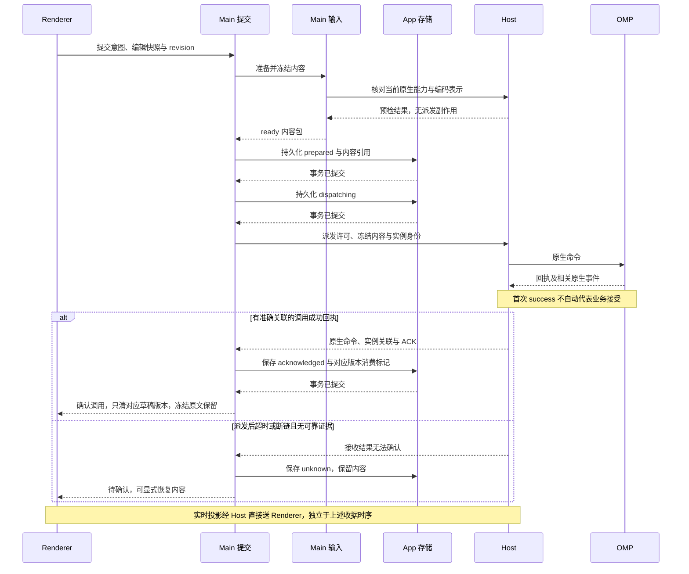
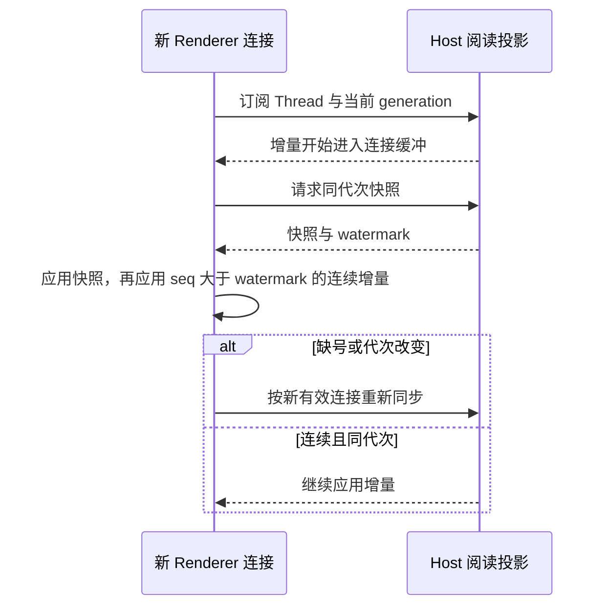

# 模块交接与关键时序

日期：2026-09-29。状态：M1 合同与 P1 文件/选区/输入代码落点已对齐；P2–P4 的执行、恢复与持久化拆分仍按对应切片推进。图说明现有合同如何组合，不定义新的 OMP 协议。术语和拥有者见[模块地图](README.md)；验收见[领域治理交接](../../../.scratch/domain-directory-governance/handoff.md)及各切片记录。

## 运行位置与通道

图中的 Main 功能按模块组织，不是一个万能控制器。配置读写可经原生 CLI/薄桥接，当前会话操作经 Host；都使用相同配置上下文，具体入口按配置切片证据选择。App 数据库不保存原生凭据或替代原生历史。

跨边界 envelope 按[TypeScript 合同](../typescript.md)解析可序列化 DTO，再核对来源、身份、代次和权限。实际经过哪些进程就在哪些进程传播 traceId；流式输出直达 Renderer，不为日志增加 Main 转发。

## 核心交接表

接口名称在实现时随切片确定；此表固定业务含义和接收方责任，不预生成完整协议 SDK。

| 交接方 → 接收方 | 必要内容 | 接收方必须保证 | 失败由谁处理 |
| --- | --- | --- | --- |
| Thread / 配置 → 操作拥有者 | threadId、workspaceId、原生引用、配置上下文、必要资源准入信息 | 执行时仍核对目录/授权/实例；不能用缓存 ready 授权 | 操作拥有者返回原因，Thread/配置提供修复入口 |
| Renderer 输入 → Main 输入/提交 | 明确编辑快照、草稿 revision、引用及提交模式 | 版本与快照一致，形成冻结内容；不异步改取新的编辑内容 | 输入定位准备失败，保留草稿 |
| 输入 → 提交 | 不可变内容包、来源/覆盖、实际可发送表示 | 全部必需项 ready，模型/编码约束仍有效 | 输入/原生适配返回限制，提交不派发 |
| 提交 → 存储 | submissionId、状态前置条件、版本与内容引用 | 事务提交后才报告持久成功 | 提交停在对应阶段；存储不重发业务 |
| Main 提交 → Host | 已持久化 dispatching 的身份、冻结内容与目标实例 | 校验目标，只派发一次，不把 App ID 塞入不支持的原生字段 | Host 报告证据或未知，Main 维护收据 |
| Host 执行 → Main 提交 | 命令/实例关联、调用 ACK 或失败 | ACK 与消费标记落盘后确认 acknowledged；迟到失败仍关联原提交 | 执行协调，写失败保留 unknown |
| Main 提交 → 输入 | 持久调用确认及对应草稿消费标记 | 清理只作用于对应版本，不覆盖新输入 | 输入保留当前版本，原提交可恢复 |
| Host 阅读 → Renderer | generation、seq、水位、来源与覆盖信息 | 先订阅缓冲再合并快照/增量；旧代次不应用 | 阅读模块重同步，显示真实缺口 |
| 文件 / 工具证据 → 变化模块 | 内容/基线/版本或原生来源、缺失/截断 | 不推断作者、不伪造前文；展示明确来源 | 文件/Git/变化功能返回局部失败 |

## 提交与持久交接

下图展现准备成功的主路径。原生事件可能与接受确认交错到达；实时展示不作为清草稿证据。完整失败规则以[执行模块](execution.md)和[基础契约 §2](../foundation-contracts.md#2-提交交接b2)为准。

准备失败不进入派发；prepared / dispatching 写失败不发原生命令。ACK 事务写失败时，不发送清稿通知给 UI；尽力保存未知状态，存储不可用时下次启动把残留 dispatching 恢复为 unknown。明确接受前拒绝才记 rejected；ACK 后错误保留 acknowledged 与原文，独立显示失败/未知，不能回填为未发送。业务 accepted 仍需独立证据。

清稿不能只依赖最后一条 UI 通知：持久化处理绑定对应 revision；通知丢失后从持久记录恢复，新 revision 不受影响。unknown 重新发送必须是新的用户提交，不能由恢复、查询缓存或存储重试自动触发。

## 窗口重连

历史页单独查询，携带可解释的来源/位置和覆盖状态；原生 busy 不等于无历史。关窗期间 Host 持续消费输出，历史浏览路径不启动 Agent。Host 重启与 Renderer 重连不同：前者需要处理原生实例残留和未决提交，不能只重建订阅就宣布任务恢复运行。

## 一条 M1 用户路径如何串联

1. Thread 建立目录关系，配置查询已有可用原生环境；文件与 Git 可先走仅浏览路径。
2. 用户允许项目执行后，Thread 和宿主落实准入、绑定原生会话。输入加载该 Thread 草稿，可附加文件选区。
3. 提交协调准备、持久化和派发；Host 将原生执行与待答交互接入阅读投影，用户继续回答、排队或停止。
4. 阅读模块提供工具来源，变化模块与 Git/文件功能生成有明确基线的 Diff，界面提供只读检查与继续输入。
5. 关闭/重开走订阅恢复；真正退出检查执行、队列、待答和后台活动。重启依据原生记录和 App 收据解释状态，不重放未知提交。

这条路径同时检验基础设施和业务模块；不要求先建完全部基础库、所有无头功能或 M3 面板。
